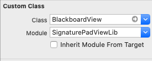
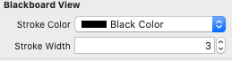
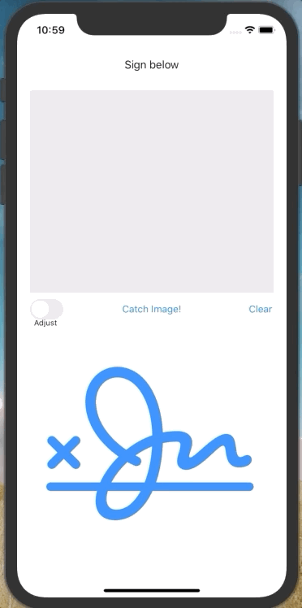

# SignaturePadViewLib
Simple swift library to capture the signature or any shape drawn on the screen

### Usage

Add pods to your project.
Then, create one view in your controller and change the view type on the identity inspector: Blackboardview

You can select the stroke color and the stroke with on the attributes inspector

### Projext Example Demo

